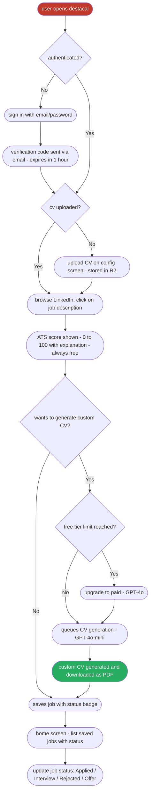

# DestacAI

DestacAI is a Chrome extension micro-SaaS that generates a custom CV for each job you apply to, optimized for ATS filters, with a built-in score that tells you exactly why your current CV isn't making the cut.

# Problem

Sometimes you're a skilled developer with great side projects and experience, however, still not getting the job you wanted. That happens with all of us. The problem is not you, it's how you're showing it. Nowadays companies are using AI ATS (Applicant Tracking System), automatically filtering you for not using specific keywords related to the job requirements.

Even though you're aware of those filtering methods and manually customize your CV for the position you want, how much time per day can you realistically spend doing this?

# Solution

DestacAI reads the job description directly from LinkedIn, scores your current CV against it (0–100), and generates a tailored version that passes ATS filters - all without leaving your browser.

Template created by DevCelio: https://github.com/celiobjunior/resume-template

# Project

At the beginning, I wanted to create a solution for the step after the application: How could you reach out the recruiters responsible for that position in order to stand out? Premium LinkedIn users can send AI-generated messages directly to recruiters, giving them an enormous advantage over other candidates. You can find recruiters without premium, but it's hard to know how to approach them. Should the message be friendly? Professional? About previous experiences? How do you show interest without looking desperate?

Even with tools like Claude, Gemini or ChatGPT available, it's easy to lose track of what you sent and whether it's consistent with your information.

This is the first sketch I did for the project.


The idea was pretty much the same as now, a Chrome extension that automatically reads job descriptions, finds the company's recruiters on LinkedIn, and generates a personalized outreach message based on your CV, keeping your approach consistent across every application. The problem was that I wouldn't know who's specifically responsible for the position and even though I knew, how long would take for the person to accept the connection invitation? How could this be tracked?

While thinking on how to address those problems, I had an even better idea: What if I pivot my solution to the previous step?

Based on this new idea, I created this User Flow using Figma:


Then I evolved the project to include a full backend, authentication, ATS scoring, and a paid tier based on model quality:



## Functional Requirements

- User signs in with email/password using custom auth logic
- Sign-up triggers a verification code sent via Brevo - expires in 1 hour
- Forgot password also sends a verification code to the user's email via Brevo
- User uploads their CV once - stored securely in the backend
- Clicking a LinkedIn job description captures it and shows an ATS score (0–100 with explanation)
- ATS scoring is always free with no generation limit
- User can generate a tailored CV (5 generations/month on free tier, unlimited on paid)
- Free tier uses GPT-4o-mini; paid tier uses GPT-4o
- Jobs are synced across devices via backend persistence
- Each job has a status badge: Applied / Interview / Rejected / Offer
- User can delete individual jobs or clear all data
- Saving the same job twice is prevented by checking the job ID
- If a generation limit is reached, the user is shown an upgrade prompt
- Config auto-saves without a Save button

## Non-Functional Requirements

- Extension only works on LinkedIn job posting pages
- Only Chrome is supported
- CV upload format: PDF, max 10MB
- CV files stored in Cloudflare R2
- Jobs and metadata stored in Postgres
- CV generation is queued via BullMQ - not blocking, handled by a background worker
- Expected CV generation time: under 30 seconds with GPT-4o-mini; up to 60 seconds with GPT-4o
- Transactional emails (verification code, password reset) sent via Brevo

## Architecture

```
Chrome Extension (React + TypeScript + Vite)
  └── Custom auth (email/password, JWT-based session)
  └── React Query (all server state - no raw fetch)

Backend (Hono on Railway)
  ├── API service     - auth middleware, REST endpoints, Stripe webhooks
  ├── Worker service  - BullMQ consumer, CV generation, ATS scoring, R2 uploads
  └── Brevo           - transactional emails (verification code, password reset)

Infrastructure
  ├── Redis (Railway addon)     - BullMQ job queue
  ├── Postgres (Railway addon)  - jobs, users, subscription state
  └── Cloudflare R2             - CV PDF file storage
```

## Tiers

| Feature | Free | Paid |
|---|---|---|
| ATS score (0–100) | Unlimited | Unlimited |
| CV generation | 5 / month | Unlimited |
| LLM model | GPT-4o-mini | GPT-4o |
| Multi-device sync | Yes | Yes |
| Job status badge | Yes | Yes |

## Trade-offs

### LLM cost model

Users no longer provide their own API key. The backend selects the model based on the user's subscription tier. Free users get GPT-4o-mini (fast, low cost). Paid users get GPT-4o. This removes signup friction and creates a clear, felt quality difference between tiers rather than a pure feature gate.

### Queue over inline generation

CV generation is enqueued via BullMQ rather than handled inline. This lets the worker process jobs asynchronously (25 jobs/min), retry on transient failures, and scale independently from the API. The trade-off is added complexity over a simple HTTP call, but it's necessary for reliable async processing.

### Serverless ruled out

CV generation can take 30–60 seconds. Serverless functions on most platforms time out at 10–30 seconds. A persistent Railway worker service avoids this entirely without the operational overhead of AWS ECS or similar.

### Cloudflare R2 over MinIO or Supabase Storage

R2 offers 10GB storage and 1M operations/month free with no egress fees and an S3-compatible API. MinIO requires self-hosting a stateful service. Supabase Storage's free tier caps at 1GB with egress costs. R2 is the lowest-ops, lowest-cost option at all scales.

### Custom auth over Clerk

Clerk was the original choice and ships `@clerk/chrome-extension` specifically for extensions. In practice, the package had compatibility issues with the Chrome extension environment that couldn't be worked around. The project now uses custom email/password auth: hashed passwords, JWT-based sessions, and verification codes sent via Brevo for both sign-up and password reset.

### CV generation approach

The LLM returns structured JSON validated against a Zod schema. The worker renders the PDF server-side using `@react-pdf/renderer` and returns it to the extension for download. Both LLM call and PDF generation happen on the backend.

---

## State Management

React Query is the only mechanism for server state in the extension - no raw `fetch`, no `useEffect` data fetching. React Query handles caching, background refetching, loading and error states.

Local UI state (form inputs, selected job) stays in React component state. Nothing is written to `chrome.storage.local` or IndexedDB directly from components.

---

## Component Structure

Components are split by feature. Shared components are reused across features.

```
src/
├── features/
│   ├── jobs/
│   │   ├── components/    # JobList, JobItem, AddJob, GenerateCV, ATSScore, EmptyState
│   │   ├── hooks/         # useJobs, useGenerateCV, useATSScore, useSelectedJob
│   │   └── services/      # cvGenerator, atsChecker
│   └── config/
│       ├── components/    # ConfigForm, CVUpload
│       ├── hooks/         # useConfig, useCV
│       └── index.ts
├── shared/
│   ├── components/        # Button, IconButton, Input
│   ├── hooks/             # useStorage
│   └── types.ts / schemas.ts / constants.ts
└── App.tsx
```

---

## Libraries

**Extension:**
- **Custom auth** - email/password with JWT sessions, verification codes, and password reset via Brevo
- **React Query** - server state, caching, background sync
- **Zod** - schema validation for API responses
- **Tailwind CSS v4** - utility-first styling
- **Framer Motion** - animations and page transitions
- **React Router DOM** - in-extension navigation
- **Lucide React** - icons
- **React Hot Toast** - notifications

**Backend (Hono on Railway):**
- **Hono** - TypeScript-first web framework
- **BullMQ** - Redis-backed job queue for CV generation and ATS scoring
- **Vercel AI SDK** - LLM provider abstraction (OpenAI GPT-4o-mini / GPT-4o)
- **Brevo** - transactional email API for verification codes and password reset
- **@react-pdf/renderer** - server-side PDF generation from structured CV data
- **pdfjs-dist** - PDF text extraction from uploaded CVs
- **@aws-sdk/client-s3** - Cloudflare R2 file upload/download (S3-compatible)
- **Stripe** - subscription management and webhooks
- **Drizzle ORM** - type-safe Postgres queries

---

## Styles

**Tailwind CSS v4** with `@theme` tokens for all design decisions - no custom CSS files, no constant variables. All styles are colocated with components using utility classes.

**Design tokens:**
- Warm off-white background with dark navy text and yellow as the primary accent
- Typography: DM Sans (UI) + DM Mono (code/keys)
- Border radius: xl to 3xl - rounded buttons and cards throughout
- Popup constrained to 360px width

**Motion:** Framer Motion handles all transitions - button press feedback with `whileTap`, page transitions with `AnimatePresence`, and list item stagger animations on mount.

---

## Code Rules

- UI components must not contain business logic. Services, LLM calls and data transformations belong in the feature's service layer or custom hooks.
- All server state goes through React Query. Never call `fetch` directly from a component.
- Helper functions used by a single component can live in the same file. If used by two or more, move to a shared location.
- Config constants (limits, feature flags) belong in `@shared/constants.ts`, not inside components.
- No external style constant files.

## How CV Generation Works

The user clicks a LinkedIn job description in the browser. The content script captures the text and sends it to the backend. The backend enqueues a BullMQ job. The worker fetches the user's CV from R2, extracts its text with `pdfjs-dist`, and calls the LLM with the CV text and job description as context.

The LLM acts as an experienced technical recruiter and follows a strict set of rules:

- **Action verbs** - a curated list of strong, specific verbs
- **Writing style** - should and avoid pattern with a list of avoided words
- **Do's and Don'ts** - explicit rules the model must follow
- **Top 5 resume mistakes** - injected as negative examples so the model learns what to avoid
- **Candidate profile** - the uploaded CV is included as context so the model only adapts existing experience, never invents or exaggerates

The LLM returns structured JSON validated against a Zod schema. The worker renders the PDF server-side via `@react-pdf/renderer` and returns it to the extension for download.

## How ATS Scoring Works

The ATS check runs as a separate, lighter LLM call - always free, no generation limit. The model compares the job description keywords and requirements against the user's current CV and returns a score from 0 to 100 with a plain-language explanation of what's missing. This is shown immediately after a job is captured, before the user decides whether to generate a tailored CV.
