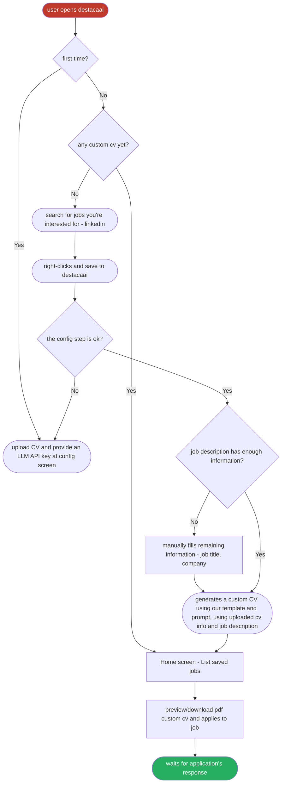

# DestacaAI

DestacaAI is an extension micro-saas that solves the problem of having generic CVs by generating a custom one for the specific position you're applying to.

# Problem

Sometimes you're a skilled developer with great side projects and experience, however, is still not getting the job you wanted. That happens with all of us. The problem is not you, it's how you're showing it. Nowadays companies are using AI ATS (Applicant Tracking System), automatically filtering you for not using specific keywords related to the job requirements.

Even though you're aware of those filtering methods and manually customize your CV for the position you want, how much time per day can you realistically spend doing this?

# Solution

DestacaAI can use your generic CV to generate a custom one to match the requirements of the position, using the right structure, sections and keywords found in the job description.

Template created by DevCelio: https://github.com/celiobjunior/resume-template

# Project

At the beginning, I wanted to create a solution for the step after the application: How could you reach out the recruiters responsible for that position in order to stand out? Premium LinkedIn users can send AI-generated messages directly to recruiters, giving them an enormous advantage over other candidates. You can find recruiters without premium, but it's hard to know how to approach them. Should the message be friendly? Professional? About previous experiences? How do you show interest without looking desperate?

Even with tools like Claude, Gemini or ChatGPT available, it's easy to
lose track of what you sent and whether it's consistent with your information.

This is the first sketch I did for the project.


The idea was pretty much the same as now, a Chrome extension that automatically reads job descriptions, finds the company's recruiters on LinkedIn, and generates a personalized outreach message based on your CV, keeping your approach consistent across every application. The problem was that I wouldn't know who's specifically responsible for the position and even though I knew, how long would take for the person to accept the connection invitation? How could this be tracked?

While thinking on how to address those problems, I had an even better idea: What if I pivot my solution to the previous step?

Based on this new idea, I created this User Flow using Figma:


Then I used mermaid to create a professional diagram:



## Functional Requirements

- User can see all saved jobs when opening the extension
- User can delete a saved job from the dropdown
- Saving the same job twice is prevented by checking the job ID
- Limited to 5 saved jobs
- If the API key is invalid or quota is exceeded, the user is notified
- User can clear all data
- If no jobs are saved, an empty state message is shown
- Config auto-saves without a Save button
- Auto-navigation to Add Job on right-click
- Form state survives popup close/reopen

## Non-Functional Requirements

- Jobs and custom CVs are deleted after 10 days
- Extension only works on LinkedIn job posting pages
- Only Chrome is supported
- CV upload format: PDF
- Max file size: 10mb
- LLM providers: ChatGPT, Claude, Gemini
- Expected CV generation time: 2 minutes

## Trade-offs

### Persistence:

I will use chrome.storage.local for structured data like job metadata and settings. For binary files such as the uploaded CV, IndexedDB will be used instead.
Only IndexedDB would mean writing significantly more boilerplate for simple things like saving the API key, with no real benefit. The code complexity isn't worth it for data that's just a few kilobytes of JSON. However, chrome.storage.local requires base64 encoding for binary data, which inflates file size by ~33% and would quickly exhaust the 5MB quota.

### Device synchronization:

Data won't synchronyze through devices and if storage is cleaned, previously generated CVs will be lost.

### BYOK (Bring Your Own Key) vs self-hosted LLM:

There are three main points I considered.

1. **Cost**: A self-hosted LLM would need a backend service and a VPS for hosting, which exceeds the budget.
2. **Quality**: Output quality depends on the provider the user chooses. GPT-4 and Claude Sonnet will produce better results than smaller models.
3. **Security**: The API key will be exposed in the extension's storage. Anyone who knows how to inspect Chrome extensions can find it.

I acknowledge those, but accept the tradeoff for MVP simplicity.

### CV generation approach:

The CV generation will use an optimized template, adapting for the specific job, without having to create structure from scratch, reducing the model's workload.

### Retry logic:

The LLM call will have retry logic at the client level to handle network errors. Future plans include more robust retry logic, request queues for high request volume, and observability, all of which would require a backend service and will be implemented based on the project's growth.

---

## State Management

State is split between React local state (in-memory while popup is open)
and persistent storage. React state is just a cache - chrome.storage.local
and IndexedDB are the source of truth.

**Config Page:**

- API Key - read from chrome.storage.local on mount, written back on change
- Provider - same as above (OpenAI, Anthropic, Gemini)
- CV - stored as a PDF Blob in IndexedDB

**Home Page / Job Page:**

- Jobs list - read from chrome.storage.local on mount
- Empty state - derived from jobs list length, no separate state needed
- Job - passed as prop from parent component, owned by the Jobs list

---

## Component Structure

Components are split by feature. Shared components are reused across features.

```
src/
├── features/
│   ├── jobs/
│   │   ├── components/    # Jobs, Job, AddJob, EmptyState
│   │   ├── hooks/         # useJobs, useSelectedJob
│   │   └── index.ts
│   └── config/
│       ├── components/    # ConfigForm, CVUpload, ApiKeyInput
│       ├── hooks/         # useConfig, useCV
│       └── index.ts
├── shared/
│   ├── components/        # Button, IconButton, Input
│   └── hooks/             # useStorage, useIndexedDB
└── App.tsx
```

---

## Libraries

- **html2pdf.js** - client-side PDF generation directly from the HTML
  CV template, no backend required
- **Tailwind CSS** - utility-first styling
- **ESLint** - static analysis and code consistency
- **React Router DOM** - navigation between Home and Config screens
- **LangChain** - used for its TypeScript interfaces and provider
  abstraction. Switching LLM providers requires changing only the
  model constructor, keeping the rest of the codebase provider-agnostic

---

## Prompt Engineering

The prompt is based on DevCelio's original template guidelines, extended
with rules specific to DestacaAI's generation approach.

The LLM is instructed to act as an experienced technical recruiter and
follows a strict set of rules:

- **Action verbs** - a curated list of strong, specific verbs
- **Writing style** - should and avoid pattern with list of avoided words
- **Do's and Don'ts** - explicit rules the model must follow
- **Top 5 resume mistakes** - injected as negative examples so the
  model learns what to avoid
- **Candidate profile** - the user's uploaded CV is included as
  context so the model only adapts existing experience, never
  invents or exaggerates

