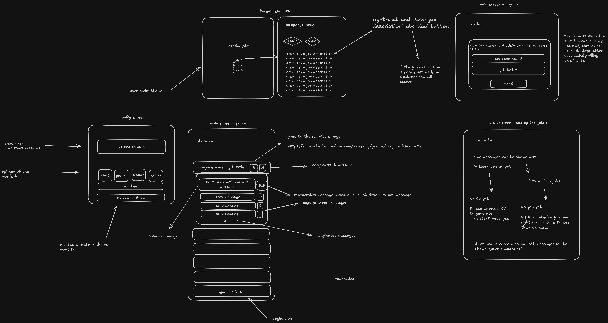
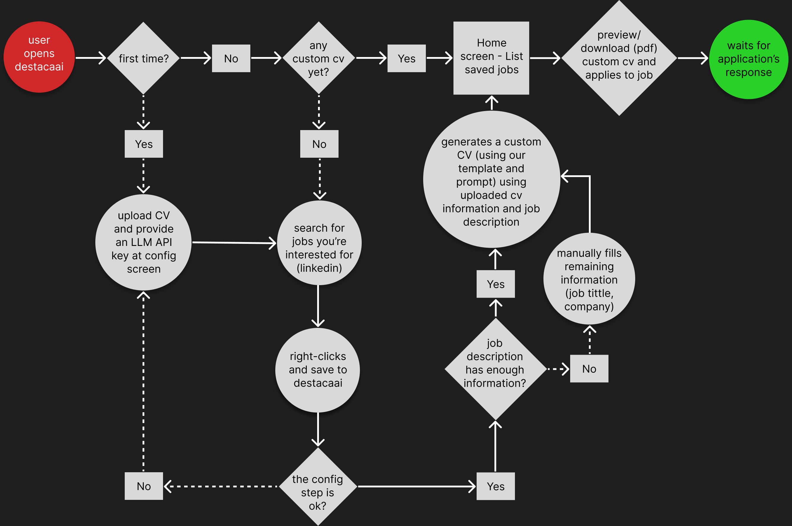
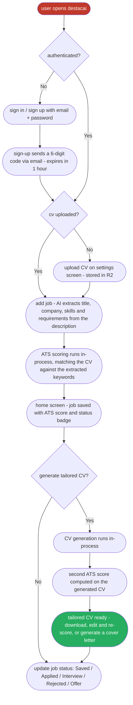

# DestacAI

DestacAI is a micro-SaaS that generates a custom CV for each job you apply to, optimized for ATS filters, with a built-in score that tells you exactly why your current CV isn't making the cut.

# Problem

Sometimes you're a skilled developer with great side projects and experience, however, still not getting the job you wanted. That happens with all of us. The problem is not you, it's how you're showing it. Nowadays companies are using AI ATS (Applicant Tracking System), automatically filtering you for not using specific keywords related to the job requirements.

Even though you're aware of those filtering methods and manually customize your CV for the position you want, how much time per day can you realistically spend doing this?

# Solution

DestacAI takes the job description for any position you're applying to, scores your current CV against it (0–100), and generates a tailored version that passes ATS filters.

# Project

At the beginning, I wanted to create a solution for the step after the application: How could you reach out the recruiters responsible for that position in order to stand out? Premium LinkedIn users can send AI-generated messages directly to recruiters, giving them an enormous advantage over other candidates. You can find recruiters without premium, but it's hard to know how to approach them. Should the message be friendly? Professional? About previous experiences? How do you show interest without looking desperate?

Even with tools like Claude, Gemini or ChatGPT available, it's easy to lose track of what you sent and whether it's consistent with your information.

This is the first sketch I did for the project.


The idea was pretty much the same as now, it would read the job description, find the company's recruiters on LinkedIn, and generate a personalized outreach message based on your CV, keeping your approach consistent across every application. The problem was that I wouldn't know who's specifically responsible for the position and even though I knew, how long would take for the person to accept the connection invitation? How could this be tracked?

While thinking on how to address those problems, I had an even better idea: What if I pivot my solution to the previous step?

Based on this new idea, I created this User Flow using Figma:


From that idea, the project evolved through several architectures. Almost every step actually *removed*
infrastructure and narrowed scope as I recognized better choices:

**Phase 1 - Browser extension, BYOK, no database.**
The first working version was a browser extension. Users brought their own OpenAI key (BYOK), there was no
backend and no database, and it could be used without an account.
When I started testing it with my own CV and applying for jobs, I realized the project could possibly turn
into a real business. Since I now work across three machines, it was hard to keep track of my applications,
because they were being saved in the browser's memory. So, for those reasons, I added a backend for better
processing, a database for persisting data, and authentication, and I moved from the BYOK approach to making
the LLM calls myself.

**Phase 2 - Vite SPA + a separate Hono backend.**
The project grew into two deployables: a Vite + React SPA and a standalone Hono API on Railway, with BullMQ
workers on Redis, Postgres (Drizzle) for persistence, Cloudflare R2 for CV PDFs, a custom JWT auth layer,
IP-based guest users, and a Stripe-backed credit system. This is where ATS scoring, real accounts, and
saved job history became possible.
**Lesson:** a proper backend and database unlocked the core features, but two separate deploys, a Redis
queue, Stripe billing, and guest-user plumbing was a lot of moving infrastructure to babysit for a project
whose real goal was to be a sharp portfolio piece, not a business.

**Phase 3 - Consolidation into one Next.js app, auth-only.**
The SPA and the Hono backend were collapsed into a single **Next.js 15 (App Router)** app: one repo, one
deploy. Auth.js (NextAuth v5) replaced the hand-rolled JWT auth; the BullMQ/Redis workers were dropped in
favor of in-process, fire-and-forget background tasks with the client polling for status; and Stripe,
guest users, and the credit system were removed entirely, leaving a clean authenticated-only flow.
**Lesson:** at this scale, synchronous in-process generation on a single long-running Node host is more than
enough. Cutting every feature that didn't serve the portfolio goal (payments, guests, a second service)
made the codebase far easier to reason about and present.

**Phase 4 - Conventions cleanup.**
Finally, I moved the project onto conventional surfaces: context into `CLAUDE.md` + `.claude/rules/`, and a
Postgres-only `docker-compose.yml` for one-command local setup.

The through-line: **every phase took infrastructure away.** Extension -> web app, BYOK -> a managed key,
no-DB -> Postgres, guest -> accounts, two services + a queue -> one app. Each change traded a bit of ambition
for a lot of clarity, which is exactly the trade a self-contained portfolio project should make.

This is the current, up-to-date user flow:


```mermaid
flowchart TD
    A([user opens destacai]) --> B{authenticated?}

    B -->|No| C([sign in / sign up with email + password])
    C --> C1([sign-up sends a 6-digit code via email - expires in 1 hour])
    C1 --> D{cv uploaded?}
    B -->|Yes| D

    D -->|No| E([upload CV on settings screen - stored in R2])
    D -->|Yes| F([add job - AI extracts title, company, skills and requirements from the description])
    E --> F

    F --> G([ATS scoring runs in-process, matching the CV against the extracted keywords])
    G --> H([home screen - job saved with ATS score and status badge])

    H --> I{generate tailored CV?}
    I -->|No| N([update job status: Saved / Applied / Interview / Rejected / Offer])
    I -->|Yes| J([CV generation runs in-process])
    J --> K([second ATS score computed on the generated CV])
    K --> L([tailored CV ready - download, edit and re-score, or generate a cover letter])
    L --> N

    style A fill:#c0392b,color:#fff
    style L fill:#27ae60,color:#fff
```

## Architecture

DestacAI is a **single Next.js 15 (App Router) application** - one repo, one deploy.

- **Frontend** - React 19 client components (React Query, Zustand, React Hook Form + Zod, Tailwind v4, Framer Motion). Routes live in `src/app/` (route groups `(app)` and `(auth)`); page-level UI in `src/screens/`, feature code in `src/features/`, shared UI/utils in `src/shared/`, infra in `src/lib/`.
- **Backend** - Next.js route handlers under `src/app/api/*` calling a ported service layer in `server/` (`features/*` → service/repository/dto/model, plus `db`, `lib`, `shared`). Uses Postgres (Drizzle ORM), Cloudflare R2 for CV PDFs, Brevo for email, and OpenAI for the LLM calls.
- **Auth** - Auth.js (NextAuth v5): Credentials provider + JWT sessions, with email-code verification and password reset as custom API routes. `src/middleware.ts` guards authed routes.
- **Async** - CV generation and ATS scoring run **in-process** as fire-and-forget background tasks (no queue/Redis). The client polls `/jobs` for status. This requires a long-running Node host (`next start`), not edge/serverless.

## Functional Requirements

- User signs up / signs in with email + password (Auth.js Credentials + JWT session cookie)
- Sign-up triggers a 6-digit verification code sent via Brevo (expires in 1 hour)
- Forgot password sends a 6-digit reset code via Brevo
- User uploads their CV once (PDF), stored in Cloudflare R2
- Adding a job auto-extracts title/company and runs ATS scoring (and CV generation when triggered)
- Jobs are persisted in Postgres and synced per user
- Each job has a status badge: Saved / Applied / Interview / Rejected / Offer
- A tailored cover letter can be generated per job
- The generated CV can be edited in-app and re-scored
- User can delete individual jobs or clear all data
- Settings auto-save without a Save button

## Non-Functional Requirements

- Works with a job description from any source
- CV upload format: PDF, max 10MB
- CV files stored in Cloudflare R2
- Jobs and metadata stored in Postgres (Drizzle ORM)
- CV generation runs as an in-process background task; expected time up to ~60 seconds
- Transactional emails (verification code, password reset) sent via Brevo

## How CV Generation Works

The user provides the job description by pasting it into the Add Job form. The backend extracts the title and company via a lightweight LLM call, then a background task fetches the user's CV from R2, extracts its text with `pdfjs-dist`, and calls the LLM with the CV text and job description as context.

The LLM acts as an experienced technical recruiter and follows a strict set of rules:

- **Action verbs** - a curated list of strong, specific verbs
- **Writing style** - should and avoid pattern with a list of avoided words
- **Do's and Don'ts** - explicit rules the model must follow
- **Top 5 resume mistakes** - injected as negative examples so the model learns what to avoid
- **Candidate profile** - the uploaded CV is included as context so the model only adapts existing experience, never invents or exaggerates

The LLM returns structured JSON validated against a Zod schema. The PDF is rendered server-side via `@react-pdf/renderer` and stored in R2 for download.

**Model selection is purpose-based.** `gpt-4o` is used for CV generation and `gpt-4o-mini` for the lighter ATS scoring and job-detail extraction (see `server/lib/llm.ts`). The Vercel AI SDK provides the LLM abstraction; only the OpenAI provider is wired.

## How ATS Scoring Works

The ATS check runs as a separate, lighter LLM call. When a job is added, ATS scoring runs automatically; CV generation can be triggered per job. The model compares the job description keywords and requirements against the user's current CV and returns a score from 0 to 100 with a plain-language explanation of what's missing. A second ATS score is computed after CV generation completes, so the user can compare their original CV score against the generated one.

Both tracks (`uploaded` and `generated`) share the same scoring function, only the R2 key differs. Scores and explanations are written back onto the job row, so the frontend reads them straight from `/jobs` without a dedicated ATS endpoint. If a row ever shows `cvGenerationStatus === 'done'` with `generatedCvAtsStatus === 'idle'` (e.g. a background scoring task failed to start), the next `/jobs` poll re-runs the tailored ATS scoring automatically.

## Local development

```bash
npm install
cp .env.example .env            # then fill in the values
npx auth secret                 # generates AUTH_SECRET (paste into .env)

docker compose up -d            # start local Postgres (matches the default DATABASE_URL)
npm run db:push                 # create the users + jobs tables

npm run dev                     # http://localhost:3000
```

- `AUTH_SECRET` and `DATABASE_URL` are required to sign up / sign in. `R2_*`, `OPENAI_API_KEY`, and `BREVO_*` are only needed once you upload a CV, generate, or send verification emails.
- Stop the database with `docker compose down` (data persists) or `docker compose down -v` (wipes it).
- After changing `server/db/schema.ts`, run `npm run db:generate` then `npm run db:push` (or `db:migrate`).

