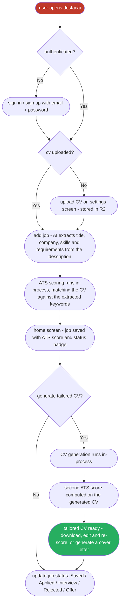

# DestacAI

Paste a job description. DestacAI scores the CV you already have against it, 0 to 100, and shows which
required keywords are missing. Ask for a tailored CV and it rewrites yours for that one job, then scores the
result so the two numbers sit side by side.

**It never invents experience.** Skills, employers, institutions and metrics that the original CV cannot
support are detected and stripped before the PDF is rendered.

## The problem

Companies increasingly filter applications with AI-driven ATS that drop candidates for missing job-specific
keywords. You can tailor your CV by hand for every application, but that does not scale past a handful.

## Story

The project started as an outreach tool: read a job description, find the company's recruiters on LinkedIn,
and generate a consistent, personalized message. The hard parts (knowing who owns a position, waiting on
connection requests, tracking it all) pushed me to pivot one step earlier in the funnel, to the CV itself.

Original sketch and the reworked Figma user flow:


From there the architecture evolved by repeatedly removing infrastructure:

- Phase 1: Browser extension, bring-your-own OpenAI key, no backend or database. Worked, but state lived in browser memory and didn't sync across machines.
- Phase 2: Vite SPA + separate Hono API on Railway, with BullMQ/Redis workers, Postgres, Cloudflare R2, custom JWT auth, guest users, and Stripe credits. This unlocked ATS scoring and saved history, but was a lot of infra to babysit for a portfolio project.
- Phase 3: Collapsed into one Next.js 15 (App Router) app. Auth.js replaced hand-rolled JWT, in-process background tasks replaced the queue, and Stripe/guests/credits were removed for a clean authenticated-only flow.
- Phase 4: Conventions cleanup, context moved into `CLAUDE.md` and `docs/`, a Postgres-only `docker-compose.yml` for one-command setup, and the email-verification step removed from sign-up.

The through-line: every phase traded ambition for clarity, which is the right trade for a self-contained
portfolio piece.

Current user flow:


```mermaid
flowchart TD
    A([user opens destacai]) --> B{authenticated?}

    B -->|No| C([sign in / sign up with email + password])
    C --> D{cv uploaded?}
    B -->|Yes| D

    D -->|No| E([upload CV on settings screen - stored in R2])
    D -->|Yes| F([add job - AI extracts title, company, skills and requirements from the description])
    E --> F

    F --> G([ATS scoring runs in-process, matching the CV against the extracted keywords])
    G --> H([home screen - job saved with ATS score and status badge])

    H --> I{generate tailored CV?}
    I -->|No| N([update job status: Saved / Applied / Interview / Rejected / Offer])
    I -->|Yes| J([CV generation runs in-process])
    J --> K([second ATS score computed on the generated CV])
    K --> L([tailored CV ready - download, edit and re-score, or generate a cover letter])
    L --> N

    style A fill:#c0392b,color:#fff
    style L fill:#27ae60,color:#fff
```

## Tech stack

Next.js 15 App Router and TypeScript. React 19 with React Query, Zustand, React Hook Form + Zod, Tailwind v4
and Framer Motion. Auth.js (NextAuth v5). Postgres + Drizzle. Cloudflare R2. OpenAI through the Vercel AI
SDK. `@react-pdf/renderer` and `pdfjs-dist` for PDFs. Brevo for email.

## Quick start

```bash
npm install
cp .env.example .env     # then fill in the values
npx auth secret          # generates AUTH_SECRET

docker compose up -d     # local Postgres
npm run db:push          # create the users and jobs tables
npm run dev              # http://localhost:3000
```

`AUTH_SECRET` and `DATABASE_URL` are enough to sign in and browse. `R2_*` and `OPENAI_API_KEY` are needed
before a CV can be uploaded, scored or generated; `BREVO_*` only for the password-reset email. Full setup,
what degrades without each variable, and how to verify a change by hand:
[docs/development.md](docs/development.md).

## Documentation

**[docs/invariants.md](docs/invariants.md) comes first.** It holds the rules that cross subsystems: what a
background task owes the job row, when a score may be read, what the model may never assert, where identity
comes from. If a sentence would have to appear in two docs, it lives there and both link to it.

After that, two things shape everything else: **the async model** in
[architecture.md](docs/architecture.md), because generation and scoring run in-process with no queue, and
**the two score tracks** in [data-model.md](docs/data-model.md), because almost every job column exists to
serve them.

| Doc | Read it when |
| --- | --- |
| [invariants.md](docs/invariants.md) | always - the cross-cutting rules |
| [product.md](docs/product.md) | you need the spec: who it is for, the requirements, what it deliberately does not do |
| [architecture.md](docs/architecture.md) | touching the layering, the `src` / `server` split, or anything background |
| [data-model.md](docs/data-model.md) | touching the schema, a column's contract, or a migration |
| [api.md](docs/api.md) | touching a route under `src/app/api` |
| [auth.md](docs/auth.md) | touching sign-in, the middleware, or the password-reset flow |
| [ai-pipeline.md](docs/ai-pipeline.md) | touching a prompt, a model choice, or CV generation |
| [ats-scoring.md](docs/ats-scoring.md) | touching anything that produces a number the user sees |
| [frontend.md](docs/frontend.md) | touching a screen, a hook, a store, or the polling |
| [jobs-ui.md](docs/jobs-ui.md) | touching the job cards, the score rings, the badges, the questionnaire or the CV editor |
| [development.md](docs/development.md) | running the app locally or verifying a change |

Some of this prose explains what was removed and why: a browser extension, a second service, a Redis queue,
Stripe billing, guest users, and an email-verification step all existed and left a shape behind. A paragraph
saying "this is gone, and here is what would have to come back with it" is doing work.
